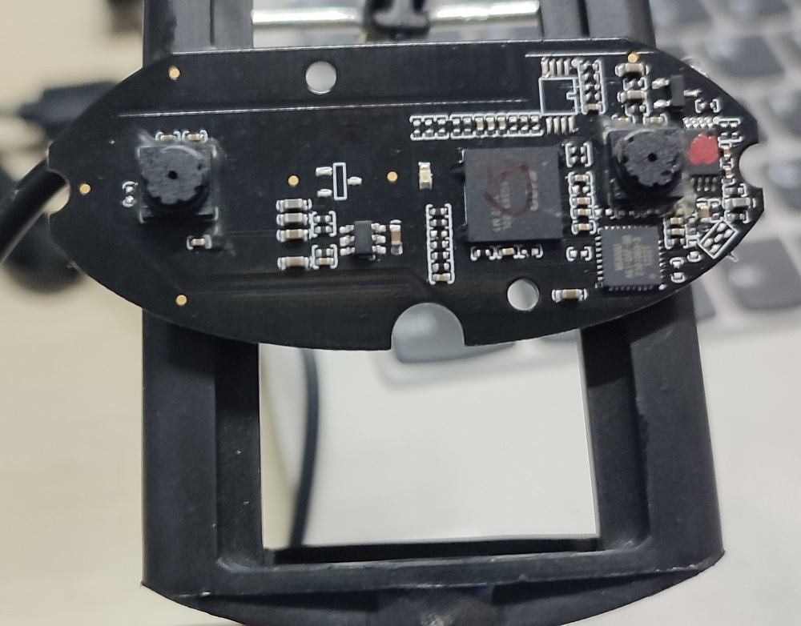

使用到的硬件为USB双目摄像头  
  

该硬件直接插上使用默认为单目（右单目），可以使用我写的[脚本](modeSwitch.sh)进行设置。图像尺寸： 640x480 。  
比如我将这个摄像头插到电脑后，对应的设备文件是 /dev/video0 (对应设备号为 0) ,那么执行：  
```bash
# 开左单目
./modeSwitch.sh 0 1

# 开右单目
./modeSwitch.sh 0 2

# 双目红蓝叠合3D图像
./modeSwitch.sh 0 3

# 双目左右分离的图像
./modeSwitch.sh 0 4
```